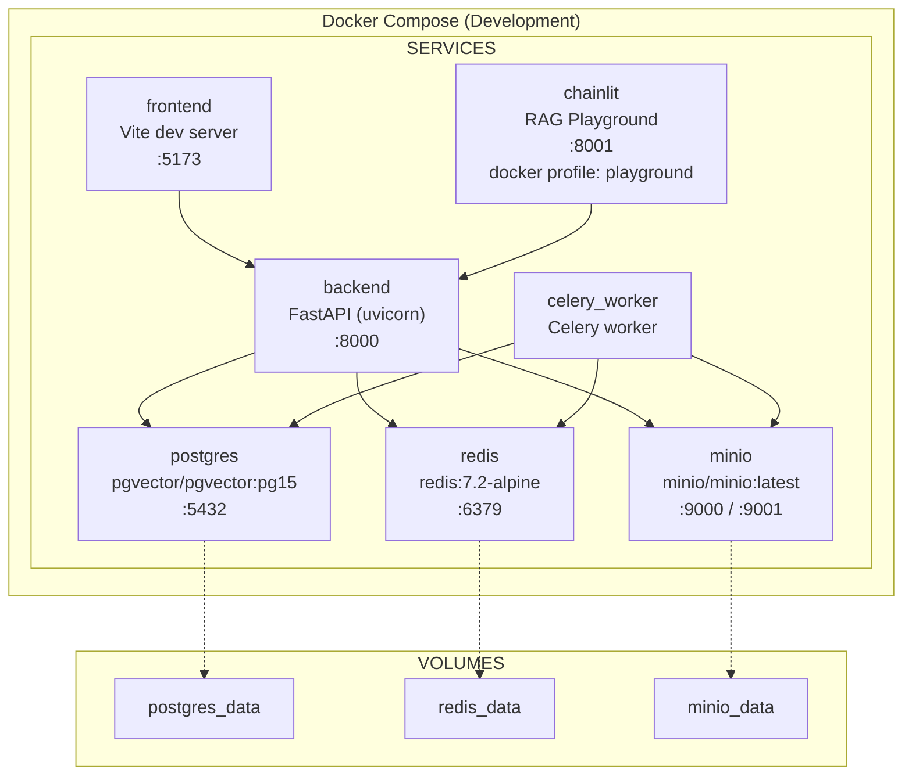
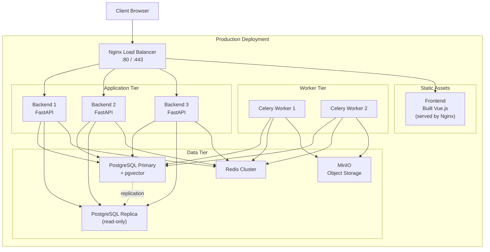
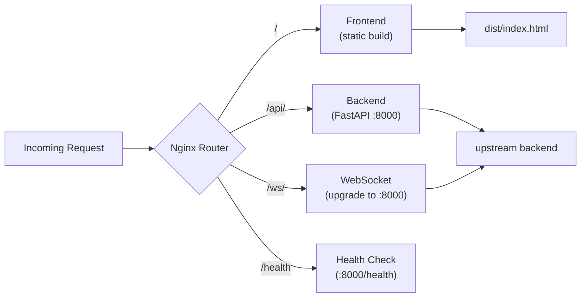

# Deployment Architecture

> Source: [deployment-guide.md](../deployment-guide.md), [system-architecture.md](../system-architecture.md)

## Development Environment

## Production Environment

## Nginx Routing

## Resource Requirements

| Environment | RAM | CPU | Storage |
|-------------|-----|-----|---------|
| Development | 2 GB | 1 core | 10 GB |
| Staging | 4 GB | 2 cores | 50 GB |
| Production | 8 GB+ | 4 cores+ | 200 GB+ |
