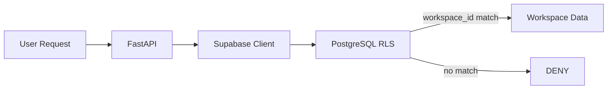

# Multi-Tenancy Design - RAG Business Document Wiki

**Last Updated:** 2026-04-04
**Status:** Planned (post-MVP)

## Overview

Multi-tenancy will enable separate organizations/workspaces to share the same infrastructure while maintaining data isolation.

## Architecture Approach

### Row-Level Security (RLS) via Supabase



### Strategy: Shared Database, Shared Schema

- All tenants share the same database and schema
- Every tenant-scoped table has a `workspace_id` column
- Supabase RLS policies enforce isolation at the database level
- App-level JWT includes `workspace_id` claim

## Database Changes (Planned)

```sql
-- Workspace table
CREATE TABLE workspaces (
    id UUID PRIMARY KEY DEFAULT gen_random_uuid(),
    name TEXT NOT NULL,
    slug TEXT NOT NULL UNIQUE,
    owner_id UUID REFERENCES auth.users(id),
    created_at TIMESTAMPTZ DEFAULT now()
);

-- Add workspace_id to tenant-scoped tables
ALTER TABLE documents ADD COLUMN workspace_id UUID REFERENCES workspaces(id);
ALTER TABLE chat_history ADD COLUMN workspace_id UUID REFERENCES workspaces(id);

-- RLS policy example
CREATE POLICY "workspace_isolation" ON documents
    USING (workspace_id = (auth.jwt() ->> 'workspace_id')::uuid);
```

## Status

| Feature | Status |
|---------|--------|
| Workspace model | Planned |
| RLS policies | Planned |
| Workspace membership | Planned |
| Workspace-scoped APIs | Planned |
| Workspace admin UI | Planned |

## References

- Supabase RLS docs: https://supabase.com/docs/guides/auth/row-level-security
- `system-architecture.md` — security section
- `flows/authentication-authorization.md` — auth flow
