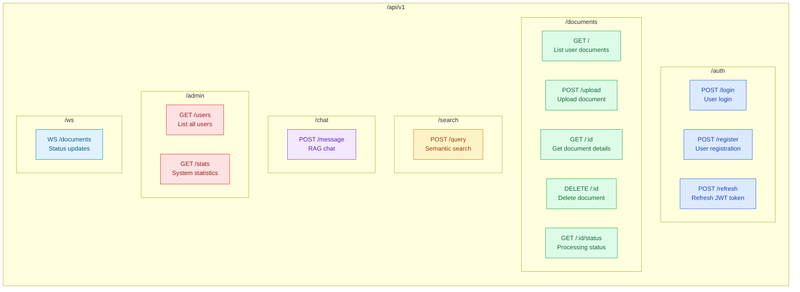

# API Endpoint Structure

> Source: [tech-stack.md](../tech-stack.md), [system-architecture.md](../system-architecture.md)

## Endpoint Details

### Authentication (`/auth`)

| Method | Path | Auth | Description |
|--------|------|------|-------------|
| POST | `/login` | None | Login with email/password, returns JWT |
| POST | `/register` | None | Create new user account |
| POST | `/refresh` | JWT | Refresh expired JWT token |

### Documents (`/documents`)

| Method | Path | Auth | Role | Description |
|--------|------|------|------|-------------|
| GET | `/` | JWT | user+ | List own documents |
| POST | `/upload` | JWT | editor+ | Upload file (PDF/DOCX/XLSX, max 50MB) |
| GET | `/:id` | JWT | owner/admin | Get document metadata |
| DELETE | `/:id` | JWT | owner/admin | Delete document + chunks |
| GET | `/:id/status` | JWT | owner/admin | Get processing status |

### Search (`/search`)

| Method | Path | Auth | Role | Description |
|--------|------|------|------|-------------|
| POST | `/query` | JWT | user+ | Semantic search, returns top 10 chunks |

### Chat (`/chat`)

| Method | Path | Auth | Role | Description |
|--------|------|------|------|-------------|
| POST | `/message` | JWT | user+ | RAG chat with source citations |

### Admin (`/admin`)

| Method | Path | Auth | Role | Description |
|--------|------|------|------|-------------|
| GET | `/users` | JWT | admin | List all users |
| GET | `/stats` | JWT | admin | System-wide statistics |

### WebSocket (`/ws`)

| Method | Path | Auth | Description |
|--------|------|------|-------------|
| WS | `/documents` | JWT | Real-time document status updates |
