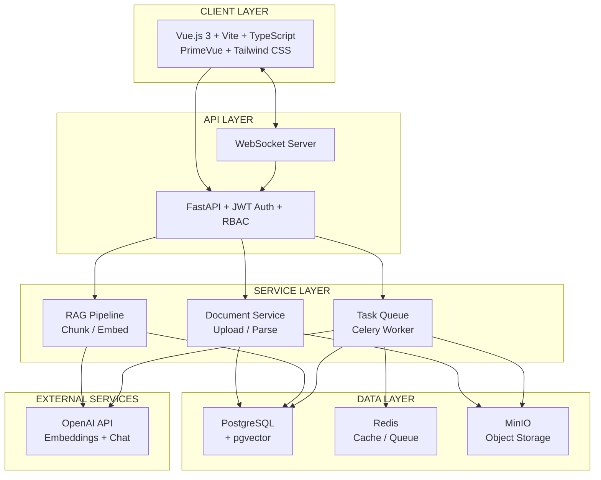

# High-Level System Architecture

> Source: [system-architecture.md](../system-architecture.md), [tech-stack.md](../tech-stack.md)

## Component Responsibilities

| Component | Responsibility |
|-----------|---------------|
| **Vue.js Frontend** | UI rendering, state management (Pinia), routing, WebSocket client |
| **FastAPI Backend** | REST API, JWT validation, RBAC enforcement, request routing |
| **WebSocket Server** | Real-time document processing status updates |
| **Document Service** | File upload, parsing (PDF/DOCX/XLSX), MinIO storage |
| **RAG Pipeline** | Text chunking, embedding generation, similarity search, response generation |
| **Celery Worker** | Async document processing, embedding generation |
| **PostgreSQL + pgvector** | Metadata storage, vector similarity search |
| **Redis** | Celery broker, result backend, session cache |
| **MinIO** | S3-compatible document file storage |
| **OpenAI API** | text-embedding-3-small (1536 dims), GPT-3.5-turbo chat |
