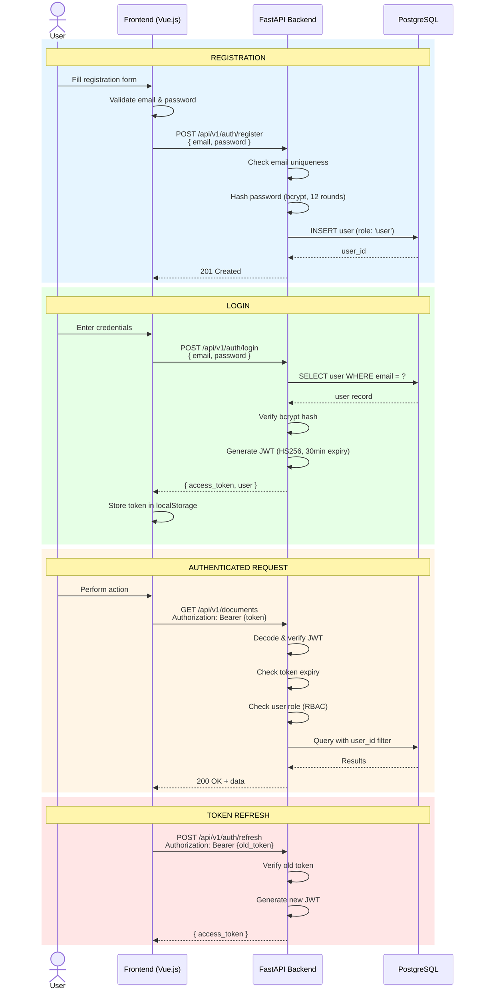
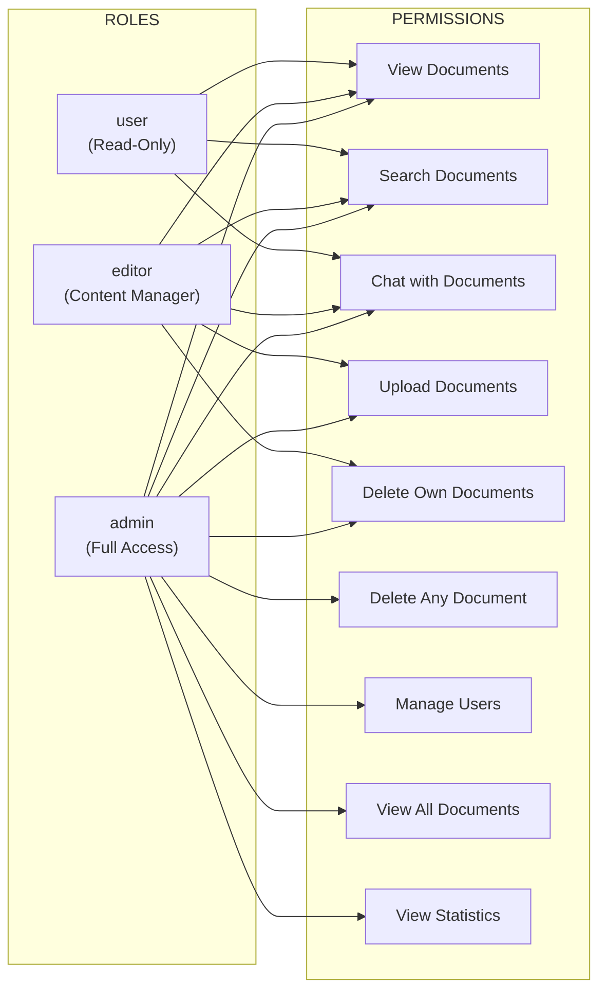

# Authentication & Authorization Flow

> Source: [system-architecture.md](../system-architecture.md) - Security Architecture

## RBAC Permission Matrix

## Security Details

| Measure | Implementation |
|---------|---------------|
| Password hashing | bcrypt, 12 salt rounds |
| Token signing | HS256 with JWT_SECRET_KEY |
| Token expiry | 30 minutes |
| Token refresh | POST /auth/refresh |
| CORS | Restricted to allowed origins |
| SQL injection | Parameterized queries via SQLAlchemy |
| Input validation | Pydantic schemas |
