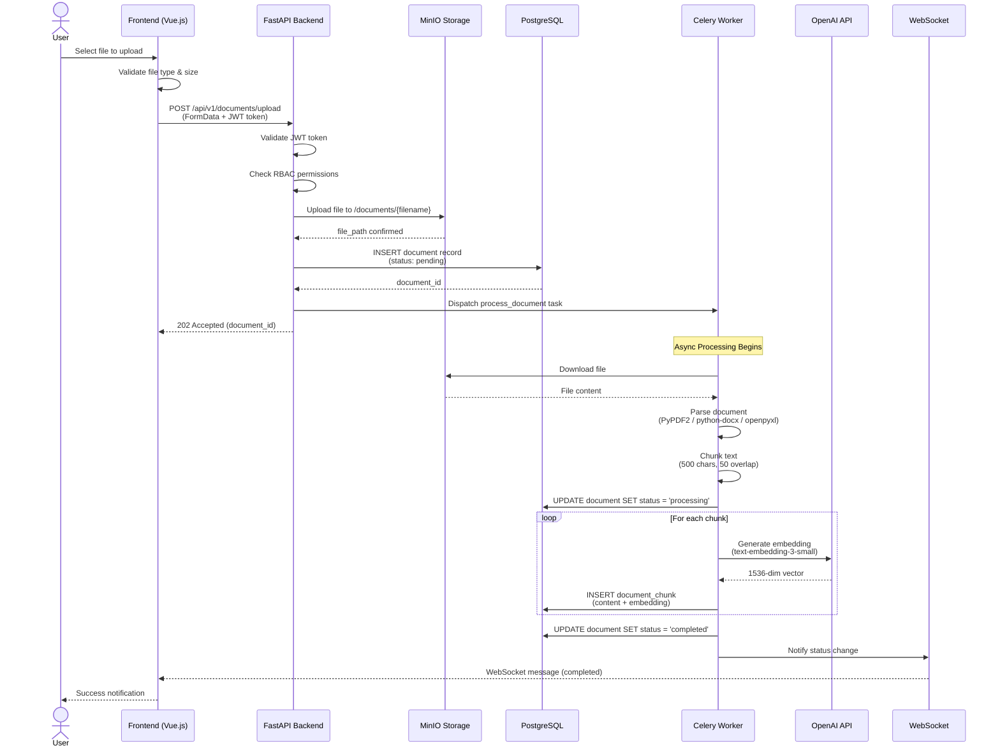

# Document Upload Flow

> Source: [system-architecture.md](../system-architecture.md) - Data Flow Diagrams

## Flow Summary

| Step | Component | Action |
|------|-----------|--------|
| 1 | Frontend | User selects file, validates type (PDF/DOCX/XLSX) & size (<50MB) |
| 2 | API | Validates JWT, checks RBAC (editor/admin role required) |
| 3 | API | Uploads file to MinIO, creates DB record (status: pending) |
| 4 | API | Dispatches Celery task, returns 202 Accepted |
| 5 | Celery | Downloads file from MinIO, parses text content |
| 6 | Celery | Chunks text (500 chars, 50 overlap), generates embeddings via OpenAI |
| 7 | Celery | Saves chunks with embeddings to pgvector column |
| 8 | WebSocket | Notifies frontend of completion status |
