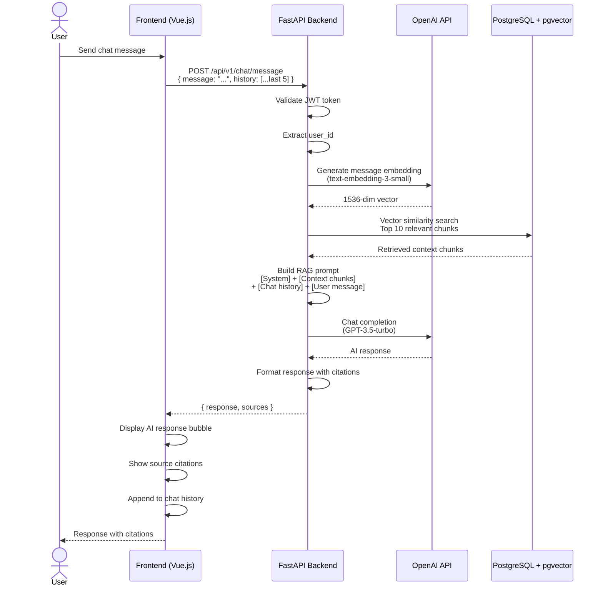

# RAG Chat Flow

> Source: [system-architecture.md](../system-architecture.md) - Data Flow Diagrams



## RAG Prompt Structure

```
System: You are a document assistant. Answer based only on the provided context.
        If the answer is not in the context, say so.

Context:
[Chunk 1 - Source: report.pdf, Page 3]
[Chunk 2 - Source: policy.docx, Page 1]
... (up to 10 chunks)

History:
User: Previous message 1
Assistant: Previous response 1
... (last 5 messages)

User: Current question
```

## Performance Target

| Metric | Target |
|--------|--------|
| Chat response | < 3 seconds |
| Context chunks | Top 10 |
| History window | Last 5 messages |
| Citation format | Document name + page |
