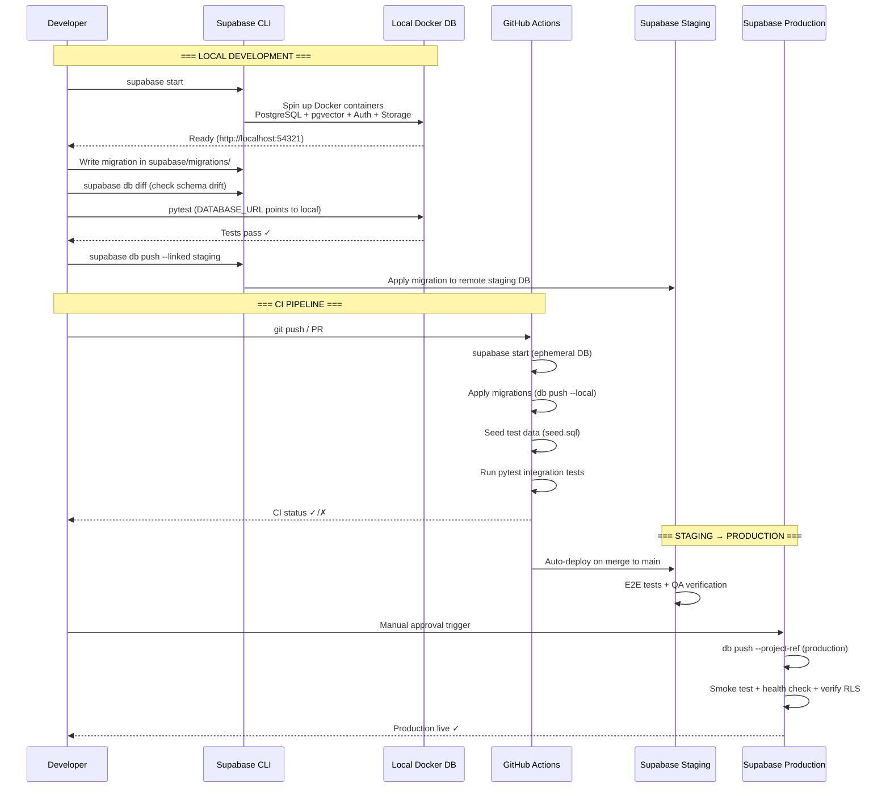
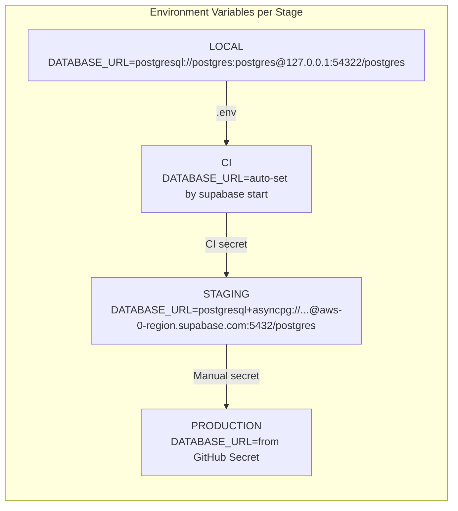

# Supabase Development Pipeline

## Overview

Full pipeline from local development → CI → staging → production using Supabase CLI, local Docker stack, and remote Supabase projects.

---

## Pipeline Diagram

```mermaid
flowchart TD
    subgraph LOCAL["🖥️ LOCAL MACHINE"]
        direction TB
        S1["supabase start<br/>Docker local stack"]
        S2["📝 Write migration<br/>supabase/migrations/"]
        S3["🧪 Run tests locally<br/>pytest + local DB URL"]
        S4["🔍 supabase db diff<br/>Check schema changes"]
        S5["📤 supabase db push<br/>--linked staging"]

        S1 --> S2 --> S3 --> S4 --> S5
    end

    subgraph CI["⚙️ GITHUB ACTIONS (CI)"]
        direction TB
        C1["supabase start<br/>Ephemeral local DB"]
        C2["📦 Apply migrations<br/>db push --local"]
        C3["🌱 Seed test data<br/>supabase/seed.sql"]
        C4["🧪 pytest<br/>Integration tests"]

        C1 --> C2 --> C3 --> C4
    end

    subgraph STAGING["🟡 STAGING (Remote Supabase)"]
        direction TB
        ST1["db push --project-ref<br/>Remote Supabase"]
        ST2["🧪 E2E + QA tests"]
        ST3["🌱 Seed data"]
        ST4["✅ Verify"]

        ST1 --> ST2 --> ST3 --> ST4
    end

    subgraph PROD["🔴 PRODUCTION (Remote Supabase)"]
        direction TB
        P1["🔒 Manual approval only"]
        P2["db push --project-ref<br/>Production project"]
        P3["🚬 Smoke test + verify<br/>Health check + RLS"]
        P4["✅ Live"]

        P1 --> P2 --> P3 --> P4
    end

    LOCAL -->|"PR / push"| CI
    CI -->|"Tests pass<br/>merge to main"| STAGING
    STAGING -->|"QA approved<br/>manual trigger"| PROD
```



---

## Detailed Flow



---

## Environment Configuration



---

## Supabase CLI Commands Reference

| Stage | Command | Purpose |
|-------|---------|---------|
| **Local Setup** | `supabase init` | Initialize supabase/ directory |
| **Local Start** | `supabase start` | Start Docker local stack |
| **Create Migration** | `supabase migration new <name>` | Create migration file |
| **Check Diff** | `supabase db diff` | Detect schema changes |
| **Test Locally** | `pytest` with local DB URL | Run integration tests |
| **Push to Staging** | `supabase db push --linked` | Apply migrations to linked project |
| **CI: Start** | `supabase start` | Ephemeral DB in CI |
| **CI: Test** | `pytest` | Run against ephemeral DB |
| **Push to Prod** | `supabase db push --project-ref <ref>` | Apply to production |

---

## File Structure

```
project-root/
├── supabase/
│   ├── config.toml              # Supabase project config
│   ├── migrations/
│   │   ├── 20260329000000_init.sql
│   │   ├── 20260329000001_enable_vector.sql
│   │   └── 20260329000002_create_tables.sql
│   └── seed.sql                 # Test/seed data
├── backend/
│   ├── .env                     # DATABASE_URL for local dev
│   ├── alembic/                 # (optional) Alembic migrations
│   └── tests/
│       └── conftest.py          # Test DB fixture
├── .github/
│   └── workflows/
│       └── ci.yml               # GitHub Actions pipeline
└── docker-compose.yml           # Only Redis + MinIO (no Postgres)
```

---

## Key Decisions

| Decision | Choice | Why |
|----------|--------|-----|
| **Migration tool** | Supabase CLI | Native pgvector support, branching, integrated with platform |
| **Local DB** | Supabase CLI Docker | Matches remote exactly (pgvector, Auth, Storage) |
| **CI DB** | Ephemeral from `supabase start` | Isolated per run, auto-cleaned |
| **Connection driver** | asyncpg (direct) | PgBouncer incompatible with asyncpg prepared statements |
| **Staging** | Separate Supabase project | Isolated from production data |
| **Production deploy** | Manual approval | Safety gate for production schema changes |
