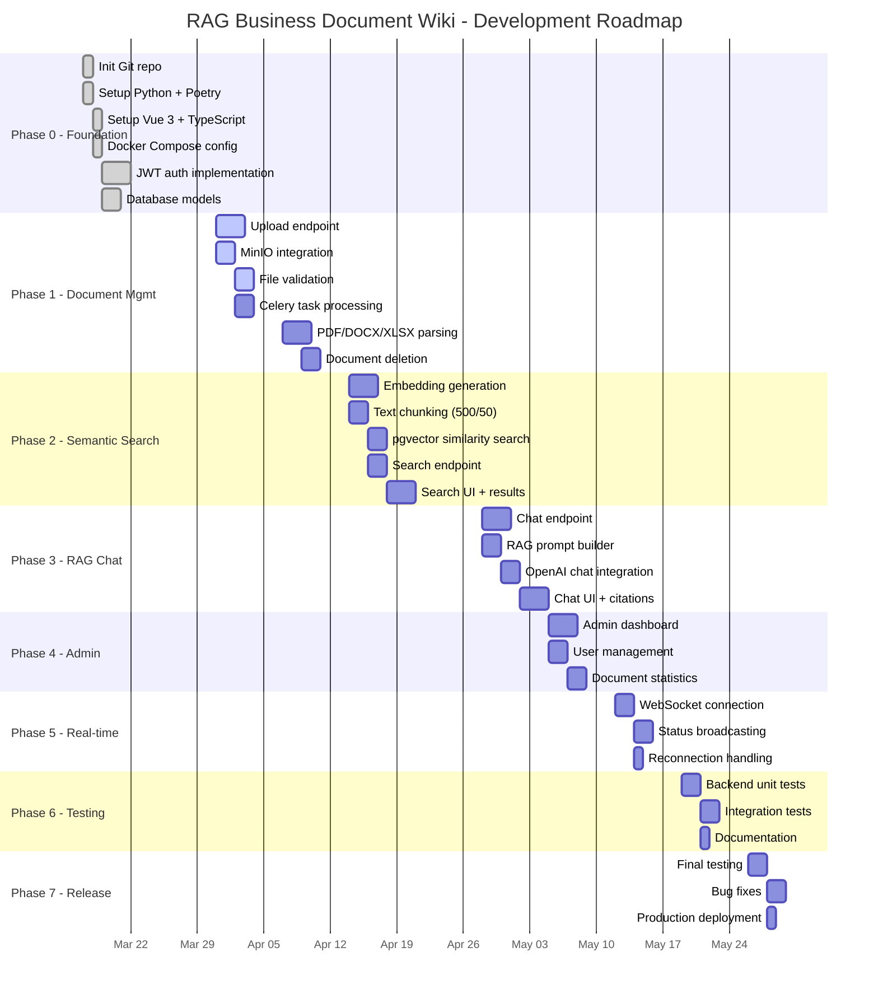
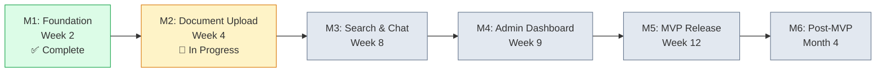

# Project Roadmap Timeline

> Source: [project-roadmap.md](../project-roadmap.md)

## Milestones

## Phase Details

| Phase | Duration | Status | Key Deliverable |
|-------|----------|--------|-----------------|
| 0 - Foundation | Week 1-2 | Complete | Auth + DB models + Docker |
| 1 - Document Mgmt | Week 3-4 | In Progress | Upload + Parse + MinIO |
| 2 - Semantic Search | Week 5-6 | Pending | Embeddings + Vector search |
| 3 - RAG Chat | Week 7-8 | Pending | Chat + Citations |
| 4 - Admin Dashboard | Week 9 | Pending | User mgmt + Stats |
| 5 - Real-time Updates | Week 10 | Pending | WebSocket + Status |
| 6 - Testing & Docs | Week 11 | Pending | 60% coverage + Docs |
| 7 - MVP Release | Week 12 | Pending | Production deployment |
