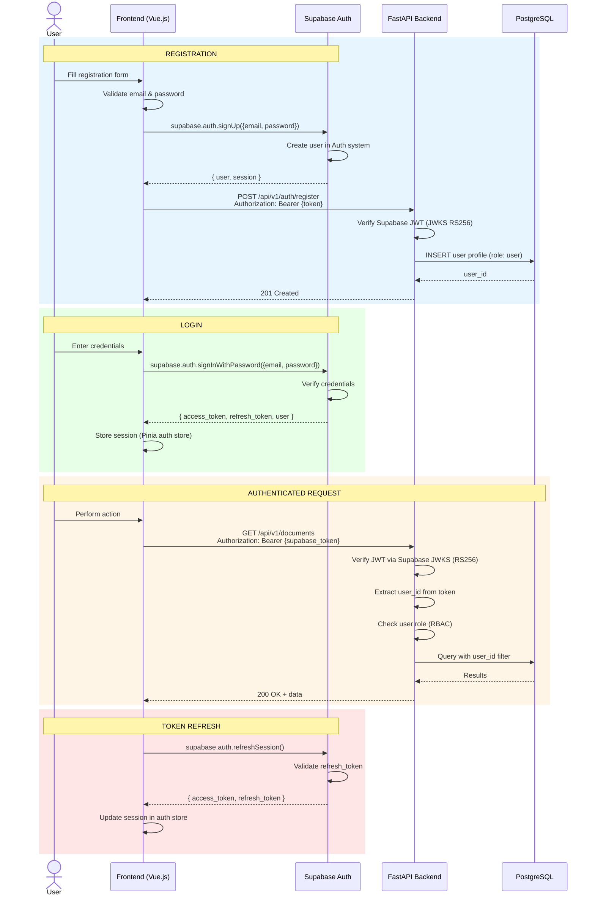
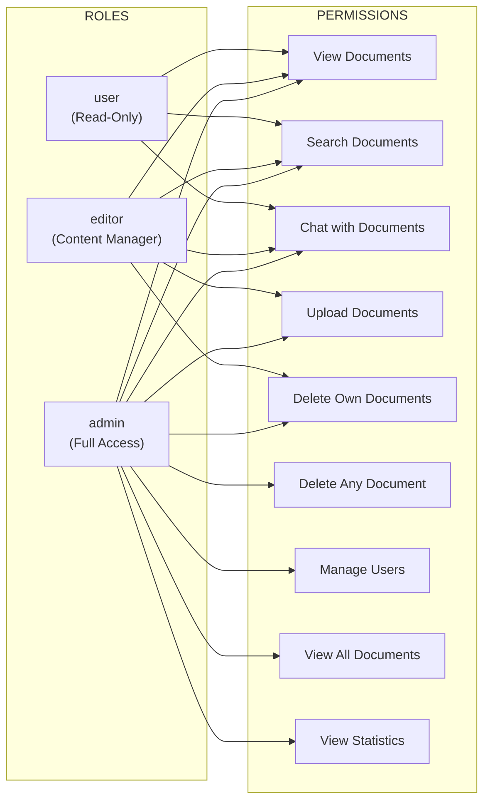

# Authentication & Authorization Flow

> Source: [system-architecture.md](../system-architecture.md) - Security Architecture

## RBAC Permission Matrix

## Security Details

| Measure | Implementation |
|---------|---------------|
| Authentication | Supabase Auth (managed) |
| Token signing | RS256 via Supabase JWKS |
| Token verification | JWKS public key rotation |
| Token refresh | supabase.auth.refreshSession() |
| Session storage | Pinia auth store |
| CORS | Restricted to allowed origins |
| SQL injection | Parameterized queries via SQLAlchemy |
| Input validation | Pydantic schemas |
