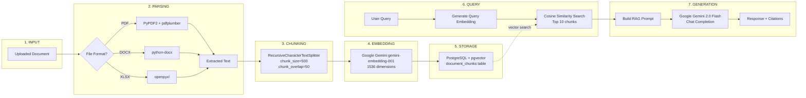

# RAG Pipeline Flow

> Source: [system-architecture.md](../system-architecture.md) - RAG Pipeline

## Pipeline Parameters

| Stage | Parameter | Value |
|-------|-----------|-------|
| Parsing | Supported formats | PDF, DOCX, XLSX |
| Chunking | Chunk size | 500 characters |
| Chunking | Chunk overlap | 50 characters |
| Chunking | Max chunks per doc | 1000 |
| Embedding | Model | gemini-embedding-001 |
| Embedding | Dimensions | 1536 |
| Search | Similarity metric | Cosine similarity |
| Search | Top-K results | 10 chunks |
| Generation | LLM model | gemini-2.0-flash |
| Generation | Max context messages | 5 (conversation history) |
