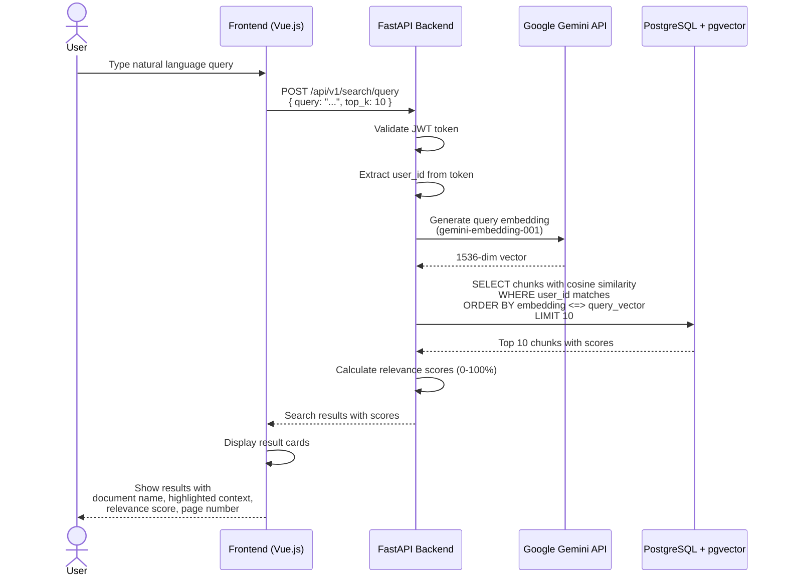

# Semantic Search Flow

> Source: [system-architecture.md](../system-architecture.md) - Data Flow Diagrams



## Response Format

```json
{
  "results": [
    {
      "chunk_id": "uuid",
      "content": "...matched text...",
      "relevance_score": 0.92,
      "document": {
        "id": "uuid",
        "filename": "report.pdf"
      },
      "chunk_metadata": {
        "page_number": 3
      }
    }
  ],
  "total": 10,
  "query": "user's search query"
}
```

## Performance Target

| Metric | Target |
|--------|--------|
| Query response | < 1 second |
| Top-K results | 10 chunks |
| Min relevance | No minimum (all returned) |
