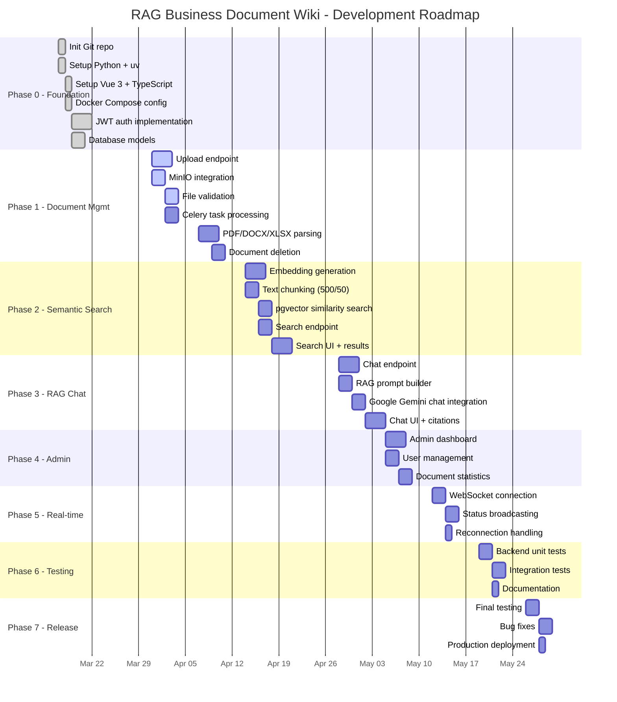
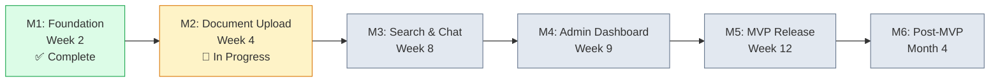

# Project Roadmap - RAG Business Document Wiki

**Project:** RAG Business Document Wiki
**Version:** 0.1.0 → 1.0.0
**Last Updated:** 2026-04-04
**Total Duration:** Q2 2026 (4 months)

---

## Timeline

## Milestones

---

## Phase 0: Foundation (COMPLETED)

**Duration:** Week 1-2
**Status:** ✅ Completed

### Objectives
- Set up development environment
- Establish project structure
- Create basic authentication system

### Tasks Completed
- [x] Initialize Git repository
- [x] Set up Python 3.11 environment with uv
- [x] Set up Vue 3 + TypeScript environment
- [x] Configure Docker Compose for local development
- [x] Implement JWT authentication (register, login, refresh)
- [x] Create database models (User, Document, DocumentChunk)

### Deliverables
- `backend/pyproject.toml` - Python dependencies
- `frontend/package.json` - NPM dependencies
- `docker-compose.yml` - Development infrastructure
- Authentication endpoints working

---

## Phase 1: Document Management (IN PROGRESS)

**Duration:** Week 3-4
**Status:** 🔄 In Progress

### Objectives
- Implement document upload functionality
- Add document parsing for PDF/DOCX/XLSX
- Create document storage with MinIO
- Implement document deletion

### Tasks

**Week 3: Upload & Storage**
- [ ] Create POST /upload endpoint
- [ ] Implement file validation (size, type)
- [ ] Integrate MinIO for object storage
- [ ] Create Document record in database
- [ ] Implement Celery task for processing

**Week 4: Parsing & Persistence**
- [ ] Implement PDF parsing (PyPDF2 + pdfplumber)
- [ ] Implement DOCX parsing (python-docx)
- [ ] Implement XLSX parsing (openpyxl)
- [ ] Store extracted text and metadata
- [ ] Implement document deletion with cascade

### Deliverables
- `backend/app/api/v1/routes/documents.py`
- `backend/app/services/parsing.py`
- `backend/app/services/minio_service.py`
- Document upload working
- Document CRUD operations

### Success Criteria
- Users can upload files up to 50MB
- Files are stored in MinIO
- Extracted text is saved to database
- Processing status updates via WebSocket

---

## Phase 2: Semantic Search (PENDING)

**Duration:** Week 5-6
**Status:** ⏳ Pending

### Objectives
- Implement vector embeddings with Google Gemini
- Create semantic search endpoint
- Display search results with relevance scores
- Add search filters

### Tasks

**Week 5: Embedding Pipeline**
- [ ] Implement embedding generation (Google Gemini gemini-embedding-001)
- [ ] Chunk text (500 chars, 50 overlap)
- [ ] Store embeddings in pgvector column
- [ ] Create vector similarity search

**Week 6: Search Interface**
- [ ] Create POST /search/query endpoint
- [ ] Implement search result filtering
- [ ] Display relevance scores
- [ ] Highlight matching context
- [ ] Add search history

### Deliverables
- `backend/app/services/llm_service.py` (embeddings)
- `backend/app/services/rag_service.py` (search)
- `frontend/src/views/Search.vue`
- Semantic search working

### Success Criteria
- Search returns top 10 relevant chunks
- Relevance scores displayed (0-100%)
- Query response < 1 second
- Results show source document

---

## Phase 3: RAG Chat (PENDING)

**Duration:** Week 7-8
**Status:** ⏳ Pending

### Objectives
- Implement RAG chat endpoint
- Integrate LLM for response generation
- Display source citations
- Manage conversation context

### Tasks

**Week 7: Chat Implementation**
- [ ] Create POST /chat/message endpoint
- [ ] Build RAG prompt with retrieved context
- [ ] Call Google Gemini chat API
- [ ] Format response with citations
- [ ] Implement conversation history

**Week 8: Chat Interface**
- [ ] Create Chat.vue view
- [ ] Display message bubbles
- [ ] Show source citations
- [ ] Add typing indicator
- [ ] Implement auto-scroll

### Deliverables
- `backend/app/api/v1/routes/chat.py`
- `backend/app/services/rag_service.py` (chat)
- `frontend/src/views/Chat.vue`
- Chat with RAG working

### Success Criteria
- Chat responses generated within 3 seconds
- Source citations displayed for each answer
- Conversation history maintained
- Context-aware responses

---

## Phase 4: Admin Dashboard (PENDING)

**Duration:** Week 9
**Status:** ⏳ Pending

### Tasks
- [ ] Create Admin.vue view
- [ ] Implement GET /admin/users endpoint
- [ ] Implement user CRUD operations
- [ ] Add document statistics
- [ ] Create activity feed
- [ ] Add role management UI

---

## Phase 5: Real-time Updates (PENDING)

**Duration:** Week 10
**Status:** ⏳ Pending

### Tasks
- [ ] Create WebSocket connection endpoint
- [ ] Implement message broadcasting
- [ ] Update document status in real-time
- [ ] Display progress indicators
- [ ] Handle reconnection

---

## Phase 6: Testing & Documentation (PENDING)

**Duration:** Week 11
**Status:** ⏳ Pending

### Tasks
- [ ] Write unit tests for all services (target 60% coverage)
- [ ] Write integration tests for API endpoints
- [ ] Write frontend component tests
- [ ] Complete documentation set
- [ ] Perform code review

---

## Phase 7: MVP Release (PENDING)

**Duration:** Week 12
**Status:** ⏳ Pending

### Tasks
- [ ] Final testing cycle
- [ ] Fix any remaining bugs
- [ ] Performance optimization
- [ ] Create production deployment guide
- [ ] Prepare Docker production images
- [ ] Final code review

---

## Phase 8: Post-MVP Enhancements (Q2 2026)

**Duration:** Month 3-4
**Status:** ⏳ Future

### Planned
- Email verification flow
- Local embeddings (sentence-transformers)
- OCR support (PaddleOCR)
- Search filters (by date, user, status)
- Chat export functionality
- Improved response formatting

---

## Phase Summary

| Phase | Duration | Status | Key Deliverable |
|-------|----------|--------|-----------------|
| 0 - Foundation | Week 1-2 | ✅ Complete | Auth + DB models + Docker |
| 1 - Document Mgmt | Week 3-4 | 🔄 In Progress | Upload + Parse + MinIO |
| 2 - Semantic Search | Week 5-6 | ⏳ Pending | Embeddings + Vector search |
| 3 - RAG Chat | Week 7-8 | ⏳ Pending | Chat + Citations |
| 4 - Admin Dashboard | Week 9 | ⏳ Pending | User mgmt + Stats |
| 5 - Real-time Updates | Week 10 | ⏳ Pending | WebSocket + Status |
| 6 - Testing & Docs | Week 11 | ⏳ Pending | 60% coverage + Docs |
| 7 - MVP Release | Week 12 | ⏳ Pending | Production deployment |

---

## Risk Management

| Risk | Severity | Mitigation |
|------|----------|------------|
| Google Gemini API cost increases | High | Use gemini-embedding-001, implement caching, fallback to local embeddings |
| Document processing time exceeds SLA | Medium | Optimize parsing, implement queue scaling |
| pgvector performance degrades | Low | Use IVFFlat index, limit to top 10, fallback to Qdrant |

---

## Decision Log

| Decision | Rationale |
|----------|-----------|
| FastAPI + Vue 3 | Async support + Composition API for better DX |
| PostgreSQL + pgvector | Simpler stack than separate vector DB |
| Google Gemini (MVP) | Free tier available, fast inference, migrate to local later |
| 500 chars / 50 overlap chunking | Balance between context and granularity |
| MinIO over S3 | Self-hosted, S3-compatible API |
